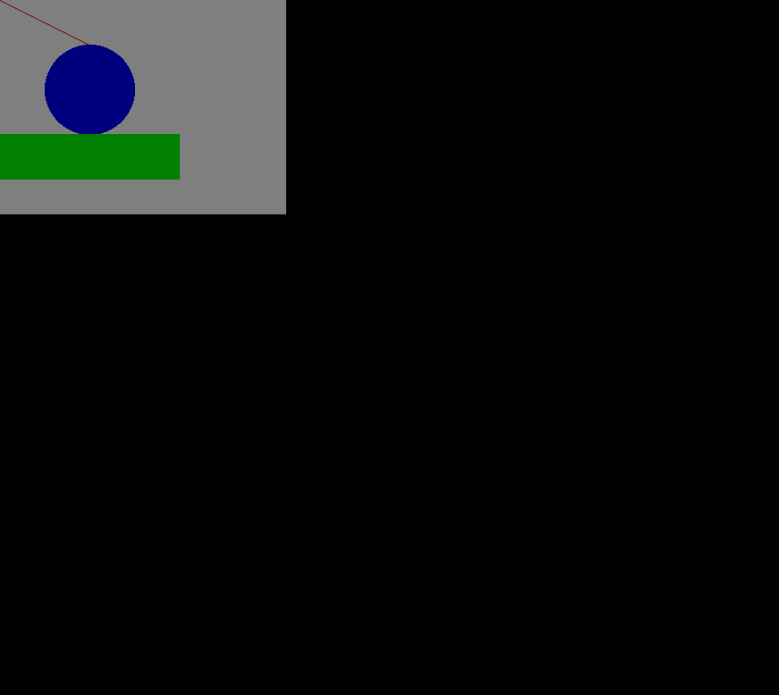

# imgui
A cross-platform, immediate mode gui library.  

At this time being, it's just a prototype to make some ideas clear. 
  

## Target
The targets of this library are as follows:

- Easy to make simple gui  
  It does not aim at being a complex/complecated gui maker.
- Cross platform, to act in
  - embeded system, even without gpu nor any graphic  processing unit. e.g. IOT devices. 
  - various desktop system, yeah, that means on Windows, Linux, MacOS etc.
  - existing gui libs. For example, being embeded into OpenGL.
- Immediate mode
  - to make it faster
  - to make it smaller
  - to make coding (thee lib) simplier
- C/C++ interface  
  It's developped in C++. To make it can be ported into other languages, a set of C interfaces is provided.
   
## Sample captures 
This prototype draws a line, fills a circle and a rectangle. And here are some captures drawn on different OSes.  
* Note: 
  There has a thin layer not part of the lib, to put drawing on screen.
  
  
***  

### __On windows, with GDI__
  
  
***  

### __On linux, with X11__
  

***  

### __On linux, with FrameBuffer__

***  

### __On linux, with DRM__

***  

### __On MacOS, with XQuartz__

